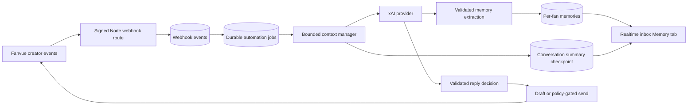

# Aurelius Chatter Architecture

Every fan memory is owned by an organization, creator profile, and fan. The AI context is assembled from safety rules, the active persona, the latest fan message, a bounded recent-message window, unresolved items, relevant active memories, the rolling summary, and approved knowledge. Complete lifetime history is never sent to the model during normal reply generation.

The webhook route verifies the raw request body before parsing. Event persistence and job enqueueing belong in the privileged server service; the route must acknowledge after durable persistence and never expose the raw payload to ordinary workspace users.